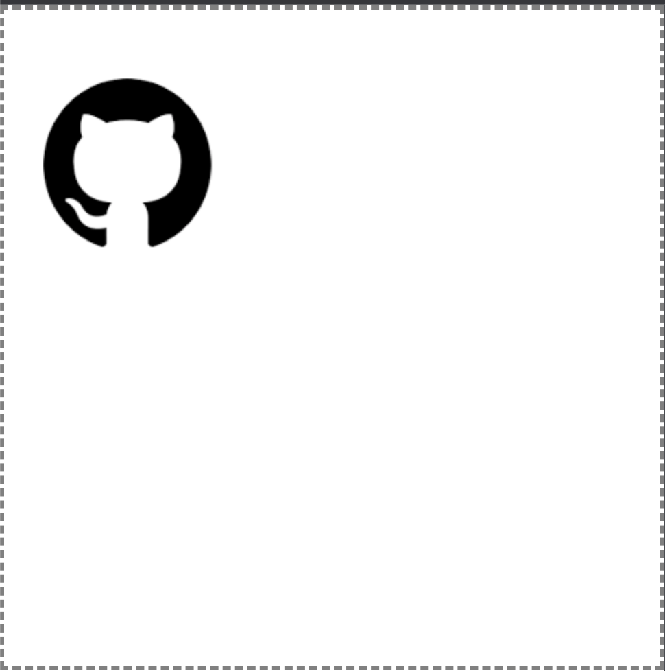

# 从0到1实现一个渲染引擎开篇

> Webgl 对于大部分从事前端开发的同学来说应该是比较陌生的,在习惯了使用 Html\Css 这样的标记性语音来渲染页面之后,Webgl 的渲染方式显得十分另类,但基于 OpenGl ES 实现的 Webgl 是图形渲染方面是更加底层的渲染方式,即使你对图形渲染不感兴趣,理解了 Webgl 之后对于浏览器是如何将 Dom 树渲染为屏幕上的一个个“像素点”也会有更深刻的理解.

在 Web 领域有很多基于 Webgl 实现的渲染引擎,(如 cocos、pixi、three.js 等等),这些渲染引擎将晦涩难懂的 Webgl 渲染流程封装成方便调用的若干“类”,在本系列文章中,我们将会实现这样一个类,保留渲染引擎中最核心的功能代码,实现一个满足 2D\3D 渲染需求的渲染引擎.

### 从 2D 渲染开始
相比于 3D 渲染, 2D 渲染更加简单一些,目标是实现这样一个 `Renderer` 类,在下面的调用方式下,实现图中的渲染效果
```js
import Renderer from '../renderer/Renderer'
// 新建一个渲染器
const renderer = new Renderer()

// 设置渲染舞台的逻辑尺寸
renderer.setStageSize({ width: 1024, height: 1024, depth: 1024 })

// 新建纹理对象
const texture = renderer.createTexture('https://encrypted-tbn0.gstatic.com/images?q=tbn:ANd9GcSy-ZMC5927eQb5ZrrpbiAQoweJykwYrrpDdCm0a88FCw&s')

/**
 * 创建精灵
 * 在2D渲染中,渲染一个矩形物体,只需要设置宽高、位置、旋转角度这三项
 **/ 
const createSprite = () => {
  const sprite = renderer.createSprite({
    size: { width: 300, height: 300 },
    position: {
      x: Math.random() * 1024,
      y: Math.random() * 1024,
      z: Math.random() * 1024,
    },
    rotation: 0,
    texture
  })
  return sprite
}

// 调用 createSprite 创建精灵
const sprite = createSprite()

// 循环调用 batchRender 
setInterval(() => {
  renderer.batchRender()
}, 30)

```



### 阅读指引
1. [WebGL 基础概念](./待实现.md)
2. [WebGL 数据绑定](./待实现.md)
3. [WebGL 纹理创建](./待实现.md)
4. [WebGL 矩阵运算](./待实现.md)
